# Physiology-guided choroid segmentation

## Context, current pre-mask pipeline, candidate methods, and benchmark snapshot

This document is designed as the scientific backbone of a presentation. It
describes what is currently implemented, what is still experimental, and what
the benchmark can—and cannot—show. The complete metric definitions and the
15-measure evaluation protocol are kept in
[CHOROID_BENCHMARK_METRICS.md](CHOROID_BENCHMARK_METRICS.md).

> **Main message.** The current work does not yet solve choroid segmentation.
> It constructs physiology-informed **pre-masks** from incomplete annotations
> and Doppler cardiac signals. These pre-masks are intended first for analysis
> and later as uncertain positive supervision for a spatial deep model.

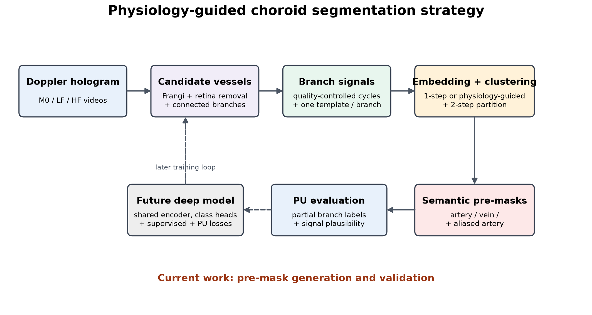

---

## 1. Why segment the choroid?

The choroid is a highly vascular tissue beneath the retina. In Doppler
holography, retinal and choroidal circulations overlap in projection, but their
temporal blood-flow signals contain information that a static image does not.
The long-term target is a five-class vascular description:

1. retinal arteries;
2. retinal veins;
3. choroidal arteries;
4. choroidal veins;
5. aliased choroidal arteries.

The retinal problem is comparatively favorable: vessels are more clearly
organized, their artery/vein identity is often visually interpretable, and a
larger labeled dataset exists. The choroidal problem is harder because vessels
are more numerous, cross or overlap in projection, have less obvious topology,
and currently have sparse expert labels.

The starting scientific idea is inherited from the retinal work in
[Dubosc et al., *Improving segmentation of retinal arteries and veins using
cardiac signal in Doppler holograms*](https://arxiv.org/abs/2511.14654): cardiac
features can add discriminative information to conventional spatial
segmentation. Here, that principle is extended to choroidal branches before
training the final image model.

### Current evidence base

- 15 choroid-focused acquisitions from five subject identifiers have now been
  processed by the global benchmark, although two currently contain only the
  common baseline rather than the exhaustive method grid.
- The choroidal masks are **partial positive annotations**. A drawn pixel is
  evidence for a class; an undrawn pixel is unknown, not necessarily negative.
- A connected candidate branch may overlap no annotation, reliable evidence
  for one class, or conflicting evidence from several classes.
- Existing single-sample results are development evidence. They must not be
  presented as independent validation.

---

## 2. Overall strategy

The project deliberately separates two questions:

1. **Where are the candidate choroidal vessels?** This is the vessel-union
   pre-mask problem.
2. **Which hemodynamic class does each candidate branch belong to?** This is
   the branch representation, clustering, and semantic-mapping problem.

The present benchmark addresses mostly the second question while keeping one
fixed candidate-vessel construction. This separation is essential: otherwise
a change in vessel detection changes the branch population at the same time as
the clustering method, and the comparison becomes uninterpretable.

### Proposed final learning architecture

The intended later model is a shared spatial encoder with multiple class heads.
Its supervision would combine:

- ordinary supervised losses for retinal masks;
- a choroid-vessel-union loss from the candidate pre-mask;
- class-specific positive–unlabeled losses from the physiology-derived masks;
- consistency or confidence weighting so uncertain pseudo-labels do not become
  hard ground truth.

The clustering pipeline is therefore a **pseudo-label generator and scientific
probe**, not a substitute for spatial learning. It uses cardiac behavior but
does not use vessel continuity, caliber, branching topology, neighborhood, or
appearance as effectively as a CNN or graph model could.

---

## 3. Current pre-mask construction

### 3.1 Inputs

For every acquisition, the pipeline uses three time-resolved Doppler bands:

- **M0:** broadband power Doppler signal;
- **LF:** low-frequency band;
- **HF:** high-frequency band.

It also uses retinal artery and vein masks to obtain a retinal arterial
reference pulse. That pulse supplies a physiological coordinate system for
correlation features and semantic mapping.

### 3.2 Candidate vessel union

The current notebook enhances line-like structures with a multiscale Frangi
filter, removes or masks retinal vessels, and converts the remaining response
into connected choroidal branches. Frangi vesselness is based on Hessian
eigenvalues across scale; see
[Frangi et al., 1998](https://doi.org/10.1007/BFb0056195).

Small connected branches are removed in the current coherent workflow
(`min_size = 25`) to reduce unstable fragments. This is useful, but it also
removes genuine small vessels and makes all later scores conditional on this
choice.

> **Unresolved checkpoint.** The notebook's historical
> `~vesselness.astype(bool)` construction is not a mathematically meaningful
> vesselness threshold. A direct Frangi–Otsu replacement previously produced
> visually unsatisfactory masks. Candidate extraction must therefore be
> benchmarked separately over ridge polarity, scale, thresholds, hysteresis,
> morphology, and branch-size filtering before it is frozen.

The current threshold-based class masks illustrate both the usefulness and
limited support of a hand-tuned pixel pipeline:

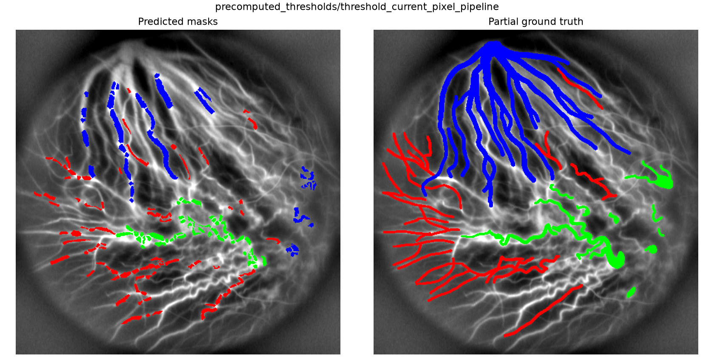

The right panel is partial ground truth. Blank vessels are unknown; they are
not confirmed errors in the prediction.

### 3.3 From pixels to branches

Let (B_b) be the pixels in branch (b), and (I_q(t,p)) the Doppler signal
at time (t), pixel (p), and band (q\in\{HF,M0,LF\}). A branch signal is
formed by spatial aggregation:

$
s_b^q(t)=\operatorname{aggregate}_{p\in B_b} I_q(t,p).
$

Working at branch level enforces spatial coherence and reduces noise. It also
introduces three approximations:

- one connected component is assumed to have one class;
- touching or crossing vessels may be merged;
- disconnected fragments of the same anatomical vessel count independently.

### 3.4 Cardiac-cycle quality control

The global runner applies the following quality-control sequence before it
computes embeddings. This section uses the real measure `260622_DUM_L_1`, for
which an auditable diagnostic already exists.

| Quantity | Value for `260622_DUM_L_1` |
|---|---:|
| Frames / sampling frequency | 640 / 144.68 Hz |
| Initial / refined period | 136 / 167 frames |
| Selected transition polarity | negative |
| Phase offset | 125 frames |
| Marked artifact frames | 39 (6.09%) |
| Complete / accepted cycles | 3 / 2 |
| Frames retained for direct video fitting | 314 |
| Emergency fallback used | no |

This preprocessing is necessary because a clustering algorithm can otherwise
organize branches by motion artifacts, discontinuities, or cycle-selection
errors rather than physiology.

#### Step 1 — construct a global temporal reference

The current candidate-vessel support is computed from the M0 video using the
same fixed pre-mask construction as the notebook. The reference signal is the
spatial average of M0 over that support:

$$
r(t)=\frac{1}{|M|}\sum_{p\in M} I_{M0}(t,p).
$$

Its purpose is to detect acquisition-wide timing and artifacts. It is not used
as an artery, vein, or aliased-artery target. Spatial averaging improves signal
to noise, although contamination of the candidate support remains a limitation.

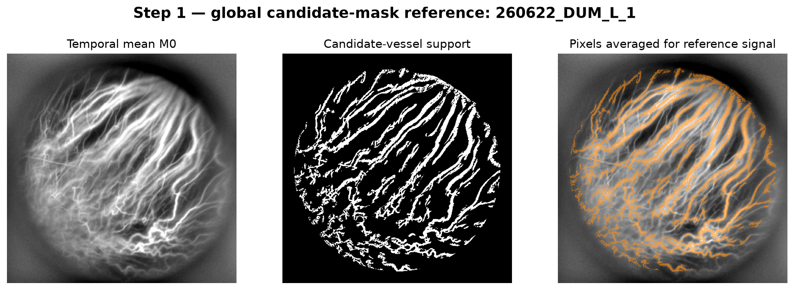

#### Step 2 — detect short impulse-and-return artifacts

The temporal derivative is centered by its median and divided by a robust
scale based on the median absolute deviation. A large derivative is only a
candidate event:

$$
z_t=\frac{\Delta r(t)-\operatorname{median}(\Delta r)}
{1.4826\,\operatorname{median}|\Delta r-\operatorname{median}(\Delta r)|}.
$$

The default candidate threshold is $|z_t|\geq6$. To avoid treating a genuine
steep cardiac edge as an artifact, the detector additionally requires an
opposite-sign derivative within 0.12 seconds and a return close to the
pre-event signal level. One neighboring frame is added on each side. On this
measure, 39 of 640 frames are marked.

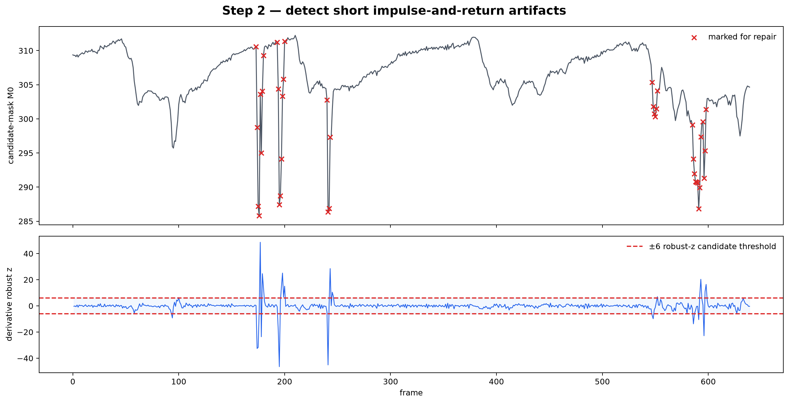

#### Step 3 — repair extracted signals conservatively

Marked samples are replaced by linear interpolation between surrounding valid
samples. The same time mask can be applied to each extracted branch signal,
but the original HDF5 videos are never modified. Correlations computed directly
from video instead omit marked frames.

The zoom shows why detection and repair are separate: only the marked short
excursions are bridged, while the slower cardiac structure is preserved.

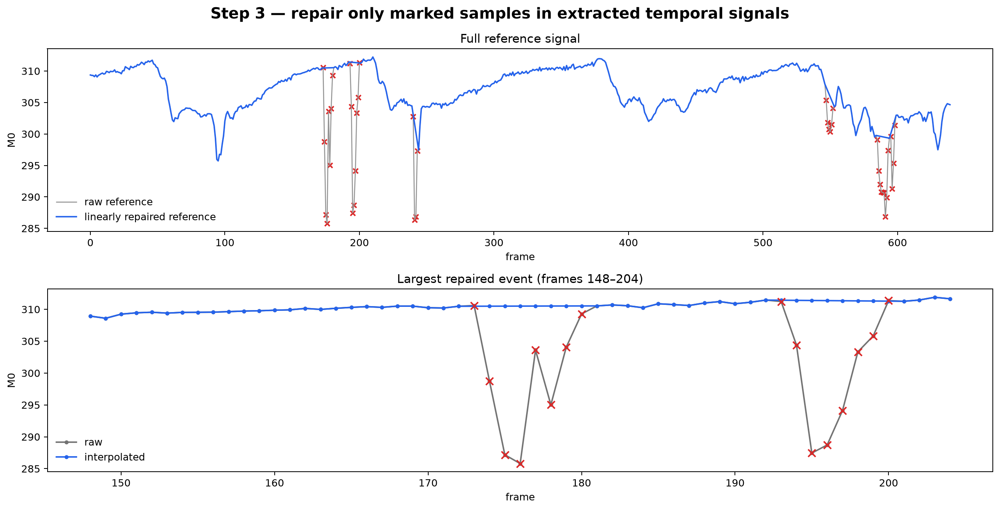

#### Step 4 — refine the cardiac period

The initial period comes from the standard pulse-period estimator. Short
records, slow trends, and harmonics can bias that estimate. The cleaned signal
is therefore detrended and examined for a nearby autocorrelation peak in
approximately $[0.7P_0,1.4P_0]$.

For this sample, the initial estimate is 136 frames. A clear peak at 167 frames
has correlation 0.67 and corresponds to 0.87 Hz. It passes the minimum
autocorrelation support, plausible-frequency, and bounded-change checks, so 167
frames becomes the working period.

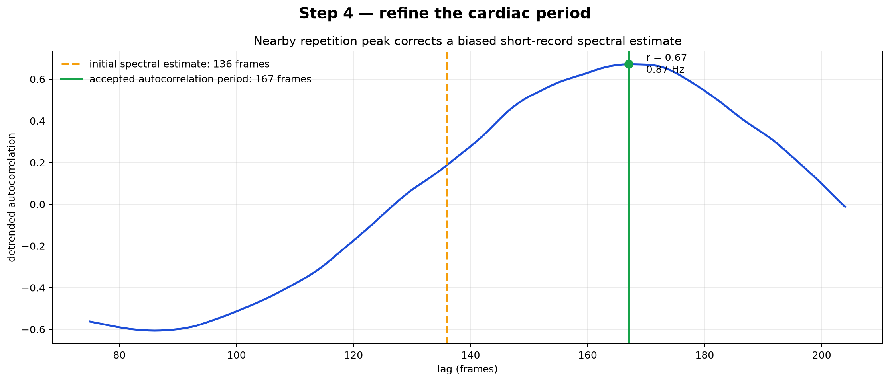

#### Step 5 — choose transition polarity and a fixed phase grid

A short Savitzky–Golay smoothing is differentiated. Positive and negative
gradient peaks are considered separately, with minimum prominence and spacing.
Each polarity is scored from anchor coverage, interval regularity relative to
the working period, and prominence. Negative transitions win for this sample,
with five detected anchors.

The anchors help establish the waveform orientation, but they are **not** used
as variable cycle boundaries. The algorithm tests every fixed-period phase
offset, first maximizing the number of complete cycles and then their median
agreement. The selected offset is 125 frames, producing the intervals
`[125,292)`, `[292,459)`, and `[459,626)`.

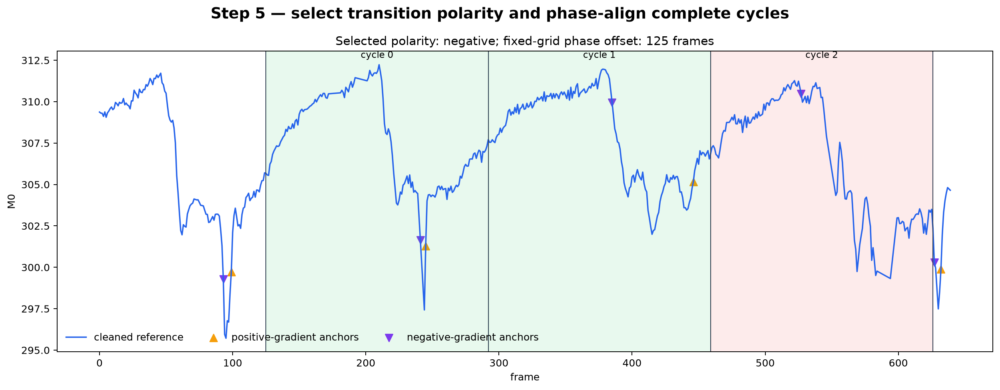

#### Step 6 — score and accept complete cycles

Each complete cycle is standardized to zero mean and unit variance. A robust
median shape is formed, after which every cycle receives three independent
checks:

- shape correlation with the median must exceed the larger of 0.5 and a robust
  lower outlier bound;
- log peak-to-peak amplitude must have robust $|z|\leq3.5$;
- no more than 15% of its frames may have been marked as artifacts.

The final decision is the conjunction of these rules and the non-constant
signal check. Cycle 2 is instructive: its shape correlation is 0.955 and its
artifact fraction is 0.114, but its amplitude robust z-score is 4.83. It is
therefore rejected for amplitude, not waveform shape. Cycles 0 and 1 are
accepted.

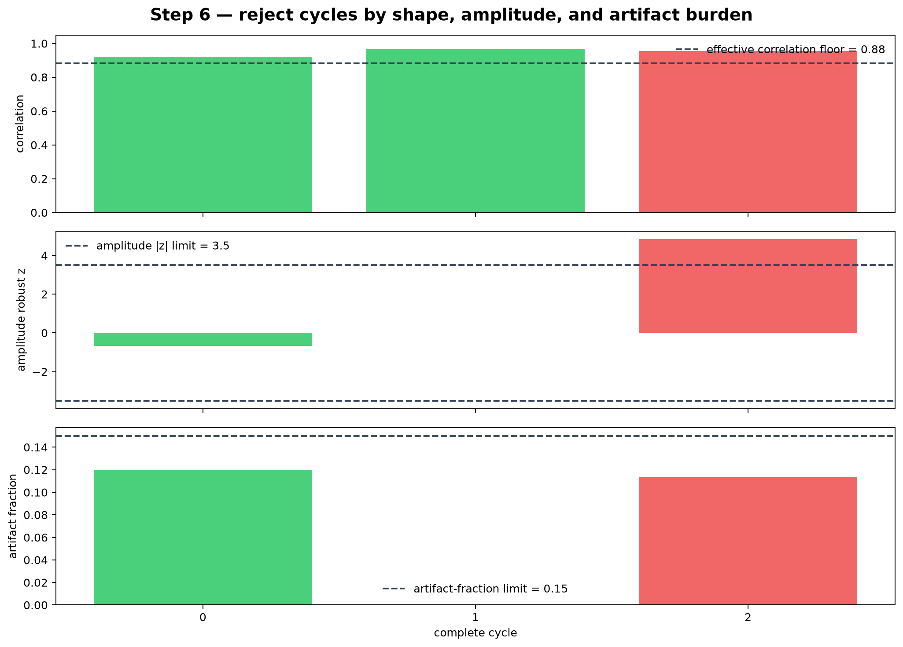

If fewer than two cycles pass, the implementation can retain the two best
eligible cycles according to a combined quality score. That emergency fallback
is recorded explicitly and was **not** used for this measure.

#### Step 7 — form the robust cycle template

Only accepted, phase-aligned standardized cycles contribute to the median
template used by Fourier, harmonic, PCA, K-Shape, and Soft-DTW representations.
The rejected cycle is displayed but excluded.

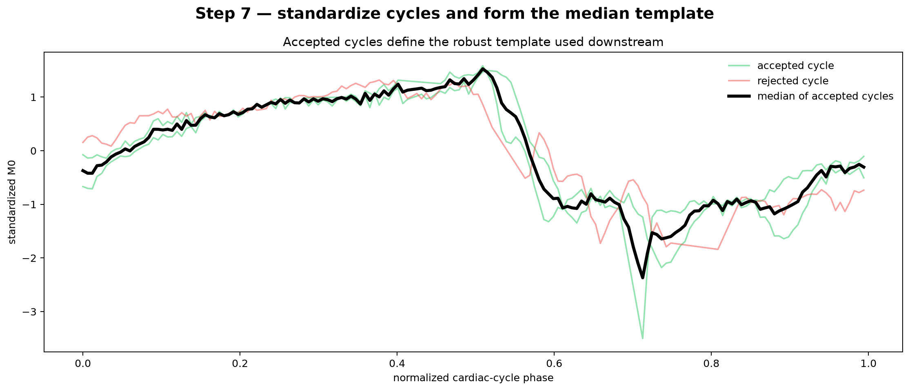

With only two accepted cycles, “median” is not strongly robust; it is their
pointwise midpoint. This acquisition should therefore contribute an explicit
usable-cycle count to every interpretation of downstream results.

#### Step 8 — expose two downstream frame masks

The pipeline keeps two masks because template construction and direct video
correlation need different treatment:

- `valid_cycle_frame_mask` contains all frames of accepted complete cycles;
  extracted signals can use it after interpolation;
- `fit_frame_mask = valid_cycle_frame_mask & ~frame_artifact_mask` additionally
  removes artifact frames and is used for correlations computed from the raw
  video.

Two accepted cycles contain 334 frames in total. Twenty marked frames lie
inside them, leaving 314 direct-fit frames.

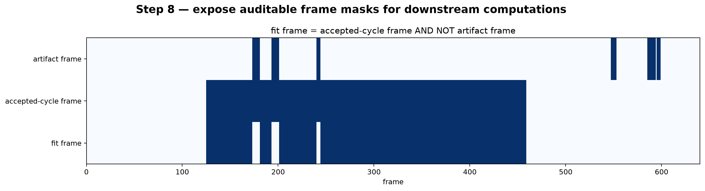

The global benchmark saves `summary.json`, `cycles.csv`, and `masks.npz` for
every measure. These files preserve period refinement, cycle boundaries,
accept/reject decisions, and exact frame masks so that preprocessing failures
are not hidden inside a final clustering score.

---

## 4. What is an embedding?

An embedding converts a full branch waveform into a representation on which a
clustering method can define similarity. Changing the embedding changes the
scientific question:

- correlation asks “does the branch vary like the retinal artery?”;
- Fourier features ask “what are its dominant periodic phase and amplitude?”;
- PCA asks “which waveform modes explain variation in this acquisition?”;
- K-Shape and Soft-DTW compare whole cycle shapes with different timing
  invariances.

No embedding is universally correct. Phase shifts can be nuisance variation in
one application and the physiological signal of interest in another.

### 4.1 Three-band retinal-artery correlation

For each branch and band, compute a Pearson coefficient against the retinal
arterial reference (r^q(t)):

$
\rho_b^q =
\frac{\sum_t(s_b^q(t)-\bar{s}_b^q)(r^q(t)-\bar r^q)}
     {\sqrt{\sum_t(s_b^q(t)-\bar{s}_b^q)^2}
      \sqrt{\sum_t(r^q(t)-\bar r^q)^2}},
\qquad
x_b=(\rho_b^{HF},\rho_b^{M0},\rho_b^{LF}).
$

Advantages are interpretability, low dimensionality, and direct use of the
retinal physiological reference. Limitations are sensitivity to waveform, a purely
linear zero-lag comparison, and dependence on a reliable retinal artery mask.

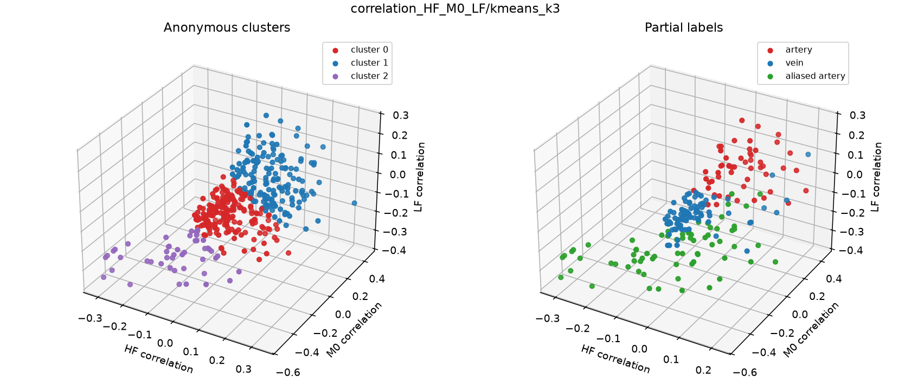

The left panel shows anonymous clusters. The right panel shows only branches
with reliable partial labels in the same coordinates. Cluster colors and class
colors are separate visual vocabularies: **red cluster 0 does not inherently
mean artery**.

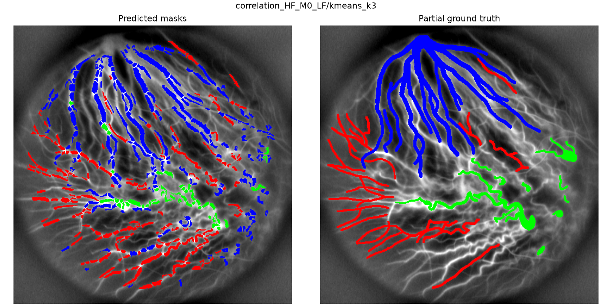

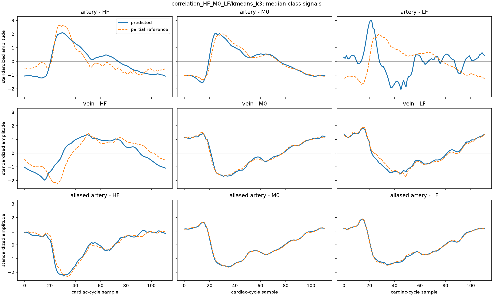

### 4.2 Complex Fourier embedding

For a cycle template (s_b(t)), the discrete Fourier coefficient of harmonic
(k) is

$
c_{b,k}=\sum_{t=0}^{T-1}s_b(t)e^{-i2\pi kt/T}.
$

The Cartesian embedding stores
((\Re c_{b,1},\Im c_{b,1},\ldots,\Re c_{b,K},\Im c_{b,K})). It preserves
amplitude and phase without a discontinuity at (-\pi/\pi). It is well suited
to nearly periodic signals but can be distorted by imperfect cycle alignment
or by scale differences unless normalization is controlled.

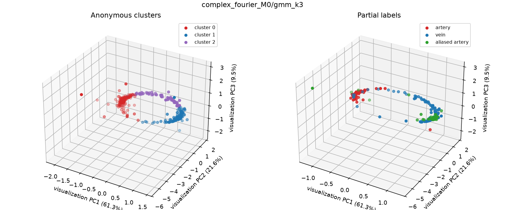

The curved structure is important: Euclidean K-means, a Gaussian mixture, and
agglomerative clustering impose different partitions on the same manifold.

### 4.3 Harmonic phase–amplitude embedding

The polar form of the Fourier coefficients separates phase and relative
amplitude. To avoid the angular discontinuity, phase is encoded as sine and
cosine:

$
h_{b,k}=
\left(
\cos\arg c_{b,k},
\sin\arg c_{b,k},
\frac{|c_{b,k}|}{|c_{b,1}|+\varepsilon}
\right).
$

This makes phase explicit and scale less dominant. Its drawback is that weak
harmonics have unstable phase, and normalizing by a weak fundamental can amplify
noise.

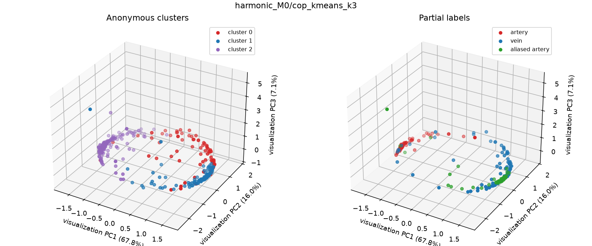

### 4.4 PCA on cycle templates

After centering the branch-cycle matrix (S), PCA finds orthogonal directions
that maximize variance:

$
S \approx U_d\Sigma_dV_d^\top,
\qquad x_b=(U_d\Sigma_d)_b.
$

PCA is compact and fast. It adapts to the acquisition instead of imposing a
fixed waveform model. However, maximum variance is not the same as maximum
class discrimination, component signs are arbitrary, and the coordinate system
can change between measures.

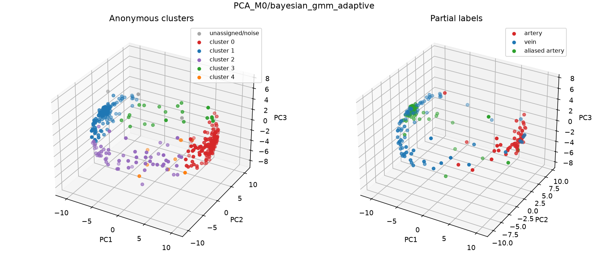

### 4.5 Gradient PCA

Gradient PCA applies PCA after temporal differentiation,
(g_b(t)=s_b(t+1)-s_b(t)). It suppresses baselines and emphasizes systolic
upstrokes and turning points. It can expose phase/shape differences hidden in
raw PCA, but differentiation amplifies noise and makes artifact cleaning more
important.

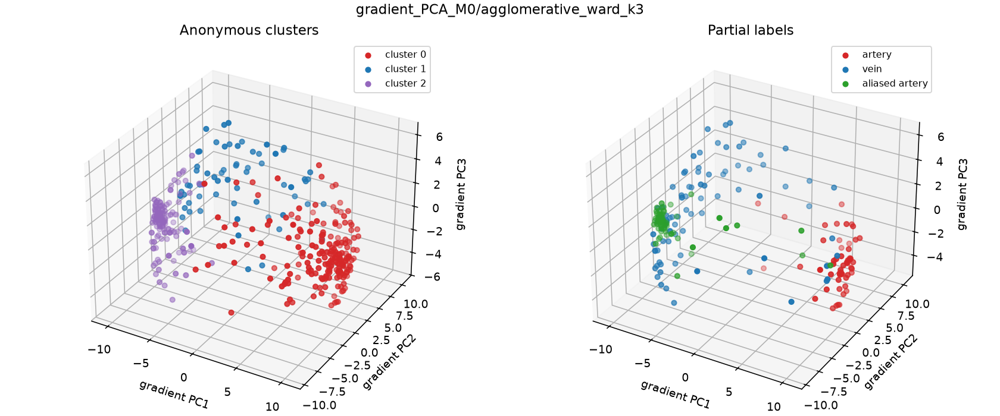

### 4.6 Autocorrelation embedding

For lags $\ell=1,\ldots,L$,

$
a_b(\ell)=\operatorname{corr}(s_b(t),s_b(t+\ell)).
$

This represents periodicity and within-signal shape without an external
reference. It is largely phase-invariant—helpful for misalignment, but
potentially harmful when artery/vein phase is the discriminating information.
The example also shows a common HDBSCAN failure mode: many small density groups
and a large noise set in a representation dominated by one direction.

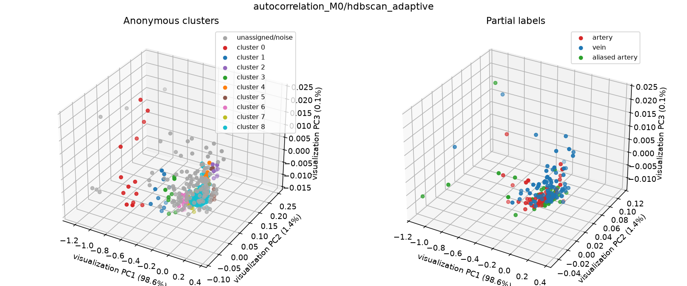

### 4.7 Whole-cycle K-Shape representation

K-Shape clusters z-normalized time series using shape-based distance:

$
d_{SBD}(x,y)=1-\max_\tau NCC(x,\operatorname{shift}(y,\tau)).
$

The method alternates phase alignment, assignment, and an eigenvector-based
shape-centroid update. It is scalable and directly represents waveform shape;
see [Paparrizos and Gravano, SIGMOD 2015](https://www.cs.columbia.edu/~gravano/Papers/2015/sigmod2015.pdf).
Its shift invariance is also its main physiological risk: it may erase a real
artery–vein delay.

The next figure is an **illustrative deterministic refit on a real development
sample**, reconstructed with the current branch pre-mask. Faint lines are
aligned branch templates; thick lines are extracted shape centroids. It is not
claimed to reproduce the older archived partition, because the legacy archive
did not save cycle templates and its branch IDs no longer exactly match the
current pre-mask reconstruction.

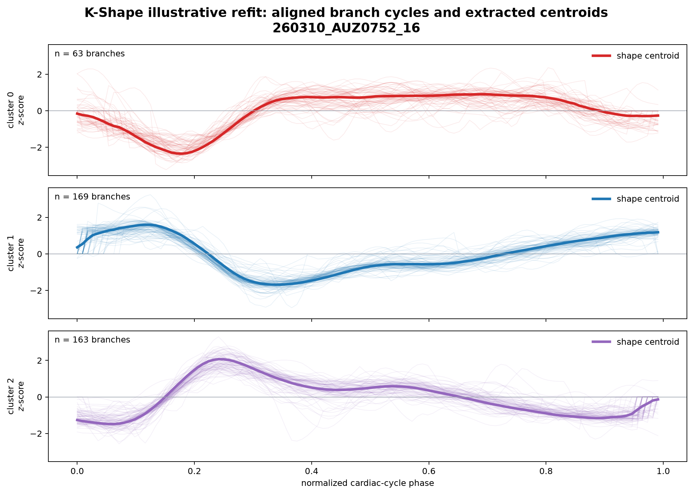

The benchmark projection and spatial masks from the earlier run remain useful
as historical outputs:

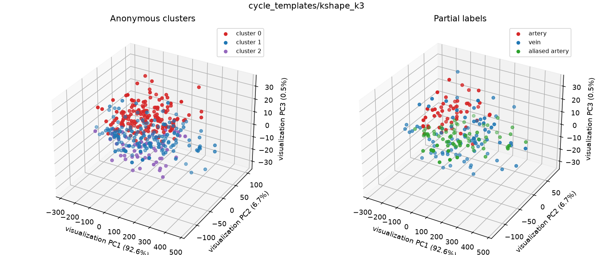


### 4.8 Soft-DTW representation and distance

Dynamic time warping compares waveforms after a monotone nonlinear alignment.
Soft-DTW replaces the hard minimum over alignment paths by a differentiable
soft minimum; see
[Cuturi and Blondel, ICML 2017](https://proceedings.mlr.press/v70/cuturi17a.html).
The benchmark uses a Soft-DTW divergence matrix with a CLARA-style sampled
k-medoids approximation.

For a set of admissible alignment paths $\mathcal P$, classical DTW retains one
minimum-cost path:

$$
DTW_0(x,y)=\min_{\pi\in\mathcal P} C_\pi(x,y).
$$

Soft-DTW replaces that minimum by a soft minimum:

$$
DTW_\gamma(x,y)=
-\gamma\log\sum_{\pi\in\mathcal P}
\exp\left(-C_\pi(x,y)/\gamma\right).
$$

As $\gamma\rightarrow0$, Soft-DTW approaches hard DTW. With $\gamma>0$,
several nearly optimal paths contribute smoothly instead of the selected path
jumping discontinuously after a small signal perturbation. The implementation
uses the self-corrected divergence

$$
D_\gamma(x,y)=DTW_\gamma(x,y)
-\tfrac12DTW_\gamma(x,x)-\tfrac12DTW_\gamma(y,y),
$$

so identical signals have zero dissimilarity even though raw Soft-DTW can have
a nonzero—and potentially negative—self-cost.

The following visualization uses cycles 0 and 2 of `260622_DUM_L_1`,
standardized and resampled to 32 points as in the clustering benchmark. The
middle panel displays DTW's single optimal path. The right panel displays the
expected occupancy of each alignment cell under Soft-DTW: bright neighboring
cells represent alternative paths that still contribute. The Sakoe–Chiba
window restricts both methods to local phase deformation.

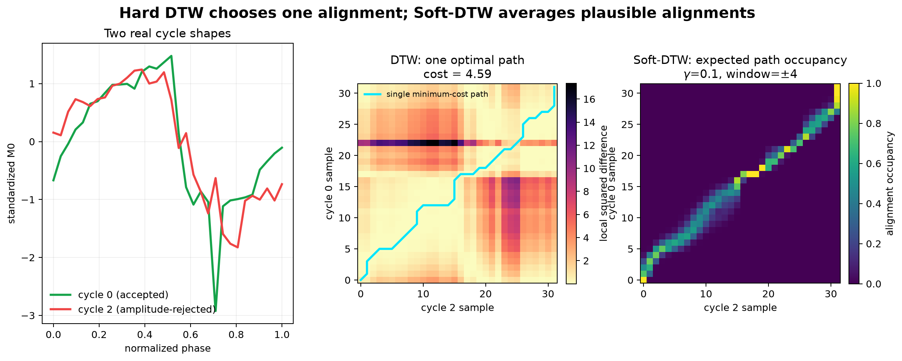

#### Why use Soft-DTW here?

- It gives a smoother dissimilarity when several local alignments have similar
  costs, which can make medoid assignments less brittle.
- Its $\gamma$ parameter explicitly controls the transition between an almost
  hard path and averaging over several plausible paths.
- It is compatible with later differentiable representation learning or
  Soft-DTW barycenters.

However, the **current benchmark uses observed medoids and does not optimize a
neural model or barycenter through this distance**. Differentiability is
therefore not currently exploited. Soft-DTW is a reasonable candidate rather
than an established superior choice. A windowed hard-DTW k-medoids baseline
should be added with the same template length, window, CLARA sampling, seed,
and weights. Comparing the two will isolate the effect of the soft minimum.

Both methods are computationally expensive: pairwise cost grows quadratically
in template length and the number of branch pairs. Both can also hide a
physiologically meaningful delay if the alignment window is too permissive.
The benchmark's current choice—32 samples, window ±4, and $\gamma=0.1$—is a
regularized engineering compromise that still requires sensitivity analysis.

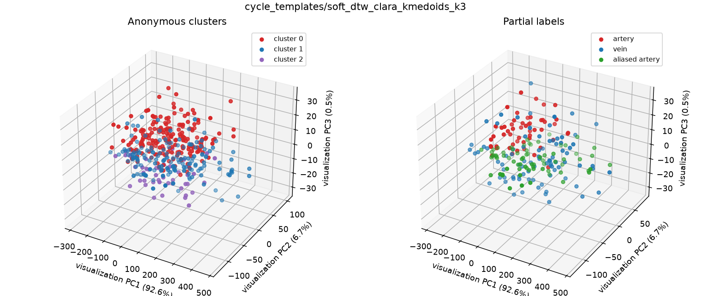

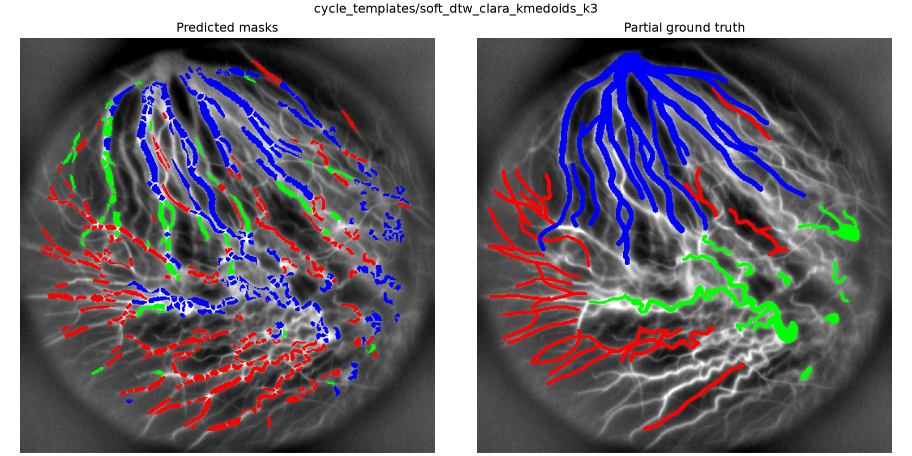

---

## 5. Clustering strategies

The embedding defines the geometry; the clustering algorithm decides how that
geometry is partitioned.

| Method | Assumption / objective | Why test it | Main failure mode here |
|---|---|---|---|
| Hand thresholds | Fixed physiological rules | Interpretable baseline | Sample-dependent cutoffs; brittle interactions |
| K-means | Spherical Euclidean clusters; fixed (k) | Fast, reproducible baseline | Outliers and nonlinear clusters move centroids |
| Weighted K-means | Weighted squared-distance objective | Reduces equal influence of 5- and 50-pixel branches | A poor weight can make trunks dominate |
| Trimmed K-means | Refit after rejecting high-residual points | Robust to feature outliers | Can discard rare true classes |
| GMM | Ellipsoidal Gaussian components | Soft assignments and unequal covariance | Singular/overlapping components; fixed (k) |
| Bayesian GMM | Mixture with shrinkage priors | Allows unused components and adaptive complexity | Prior-sensitive; extra components are not automatically physiological classes |
| Agglomerative | Greedy hierarchy with a linkage rule | Deterministic family; exposes nested structure | Early merges cannot be undone; linkage strongly changes result |
| HDBSCAN | Persistent density clusters + explicit noise | Does not force (k); handles outliers | Density varies across the embedding; may fragment heavily |
| K-Shape | Shift-invariant normalized waveform shape | Direct cardiac morphology | Can remove meaningful phase |
| Soft-DTW k-medoids | Nonlinear temporal alignment | Handles local timing/stretch variation | Very expensive; can over-align |
| COP-KMeans | K-means with must/cannot-link constraints | Uses a subset of reliable partial labels | Constraint conflicts; not label-free on a new measure |

### 5.1 Branch weighting

The benchmark currently uses clipped square-root branch area:

$
w_b=\operatorname{clip}(\sqrt{|B_b|},q_{0.05},q_{0.95}).
$

This is a compromise between one-branch-one-vote and raw pixel weighting.
Weighted methods have not consistently improved the masks, which suggests that
area is not the same as reliability. Better future weights may combine length,
width, signal-to-noise ratio, cycle consistency, Frangi confidence, and
annotation confidence.

### 5.2 Robust clustering: trimming

Trimmed K-means fits clusters, temporarily removes the largest residuals, and
refits. The grey/unassigned points visible in some figures should be evaluated
with coverage; a high score after discarding many hard branches is not a better
complete pre-mask.

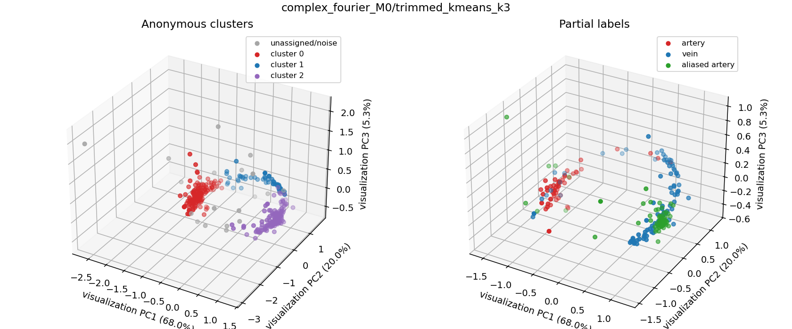

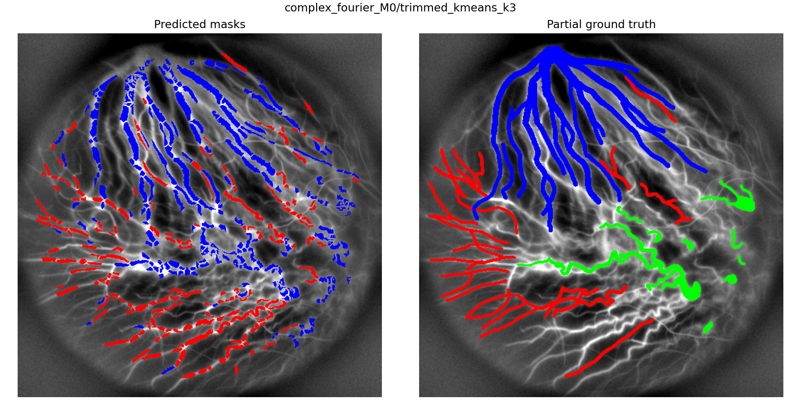

### 5.3 Adaptive cluster count and noise

Bayesian GMM and HDBSCAN avoid treating every candidate branch as one of
exactly three classes. This directly addresses the possibility that the
candidate mask contains artifacts or several subtypes. However, an adaptive
statistical cluster is not automatically an anatomical class, and an unmapped
noise set still needs a downstream policy.

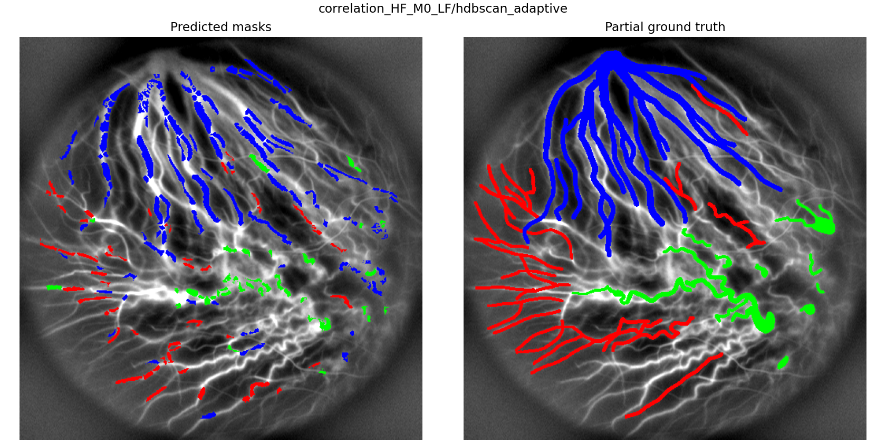

### 5.4 Partial-label constraints

COP-KMeans constructs must-link relations between reliable branches of the
same annotated class and cannot-link relations between different classes. The
constraint subset must be separated from the held-out labeled subset; otherwise
evaluation is resubstitution.

This is a legitimate semi-supervised benchmark, but it answers a different
question from a deployable unsupervised method. On a new unlabeled measure,
there are no local manual constraints unless a trained cross-measure model or
physiology prototypes provide them.

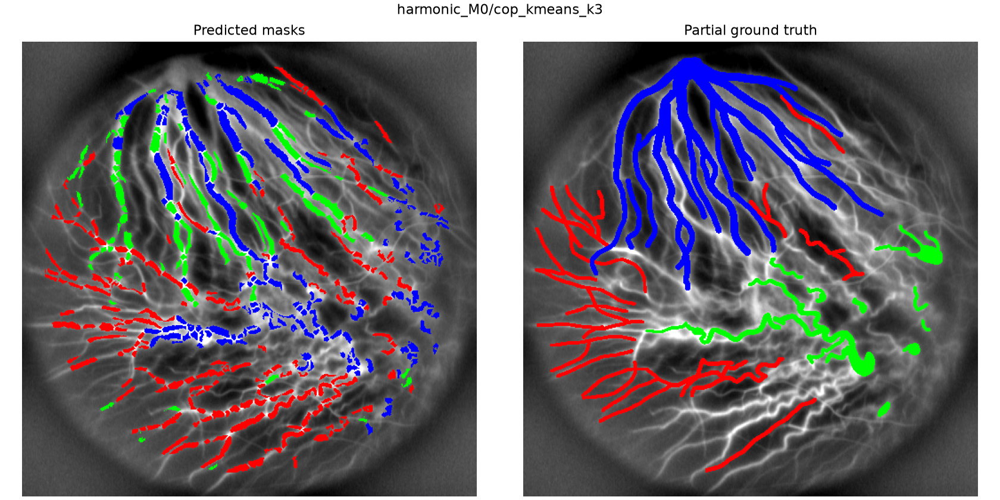

See [Wagstaff et al., *Constrained K-means Clustering with Background
Knowledge*](https://www.wkiri.com/research/research-cluster.html) for the
must-link/cannot-link formulation. For adaptive density clustering, see
[McInnes et al., 2017](https://joss.theoj.org/papers/10.21105/joss.00205).

---

## 6. One-step and two-step physiological organizations

### 6.1 One-step

One-step methods partition all candidate choroidal branches together. The
benchmark now uses three or four clusters—never only two—because the expected
semantic targets are artery, vein, and aliased artery, possibly with an extra
subtype/noise cluster.

Advantages:

- fewer irreversible decisions;
- all classes share the same representation;
- extra clusters can expose substructure.

Limitations:

- anonymous labels need semantic mapping;
- a rare class can disappear inside a dominant cluster;
- one geometry may not separate both physiological decisions.

### 6.2 Two-step

The current two-step hypothesis decomposes the task:

1. separate artery-like branches from the remaining candidates;
2. split the remaining branches into vein and aliased artery.

Each stage is binary, but the final output has three semantic masks. A two-step
visualization must therefore be read hierarchically.

#### Stage 1 — gradient-PCA + K-means

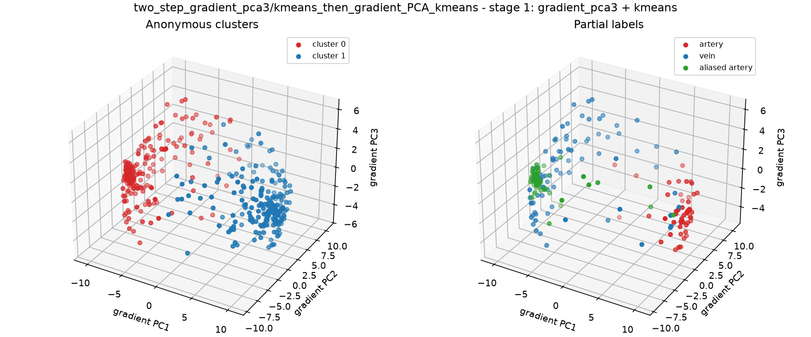

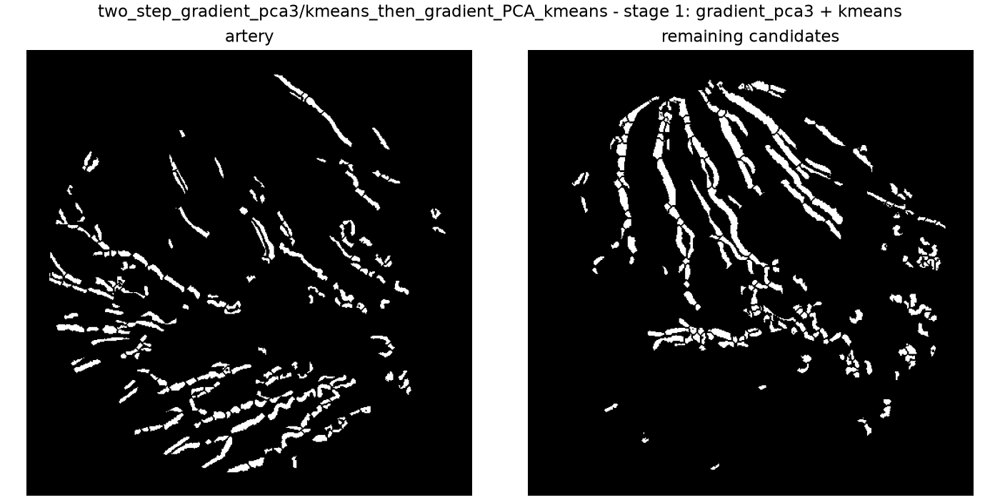

#### Stage 2 — gradient-PCA + K-means on the retained subset

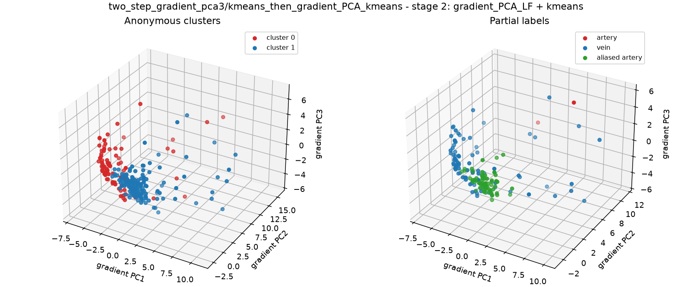

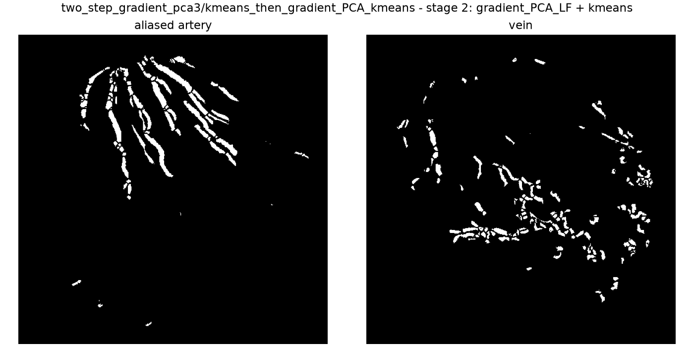

#### Final masks and signals

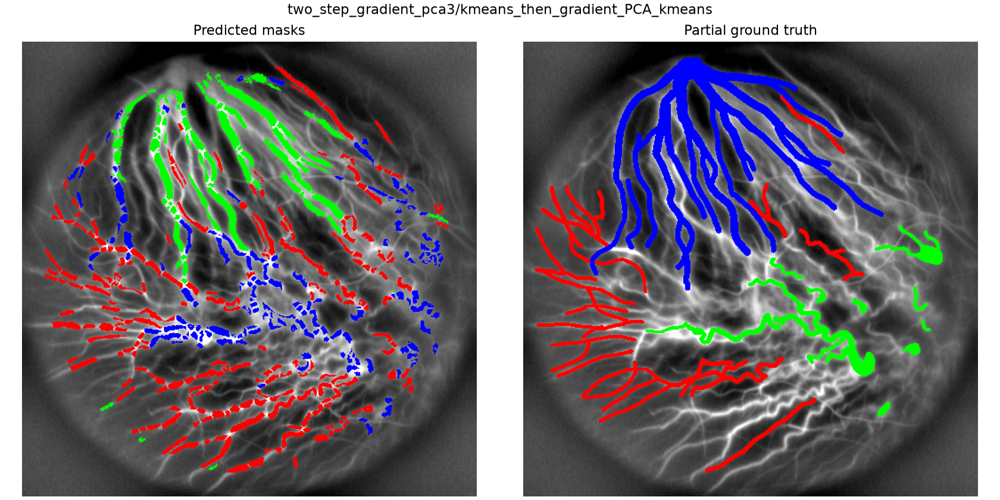

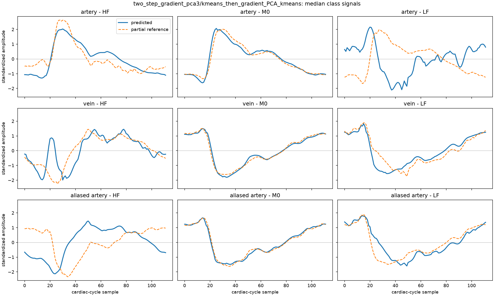

The decomposition is interpretable and can use different features at each
decision. Its central weakness is error propagation: a branch assigned to the
wrong side at stage 1 cannot be recovered at stage 2. Stage-wise metrics and
masks must therefore be inspected, not only the final score.

---

## 7. From anonymous clusters to artery/vein masks

Clustering returns arbitrary numeric IDs. `cluster 0` has no stable semantic
meaning between algorithms, seeds, or measures.

### Offline visualization mapping

For current one-step benchmark visualizations, each cluster is named with the
class having the largest weighted evidence in the constraint subset. Several
clusters may map to the same class; a cluster without evidence remains
unmapped. The held-out subset is then used for semantic scores.

This mapping is useful for analysis but unavailable when a completely unlabeled
new measure is processed.

### Label-free deployment diagnostic

The benchmark also matches cluster-level HF/M0/LF correlation profiles to
provisional artery, vein, and aliased-artery physiology prototypes. This can be
used without local manual masks, but it tests two things simultaneously:

1. whether the clustering separated meaningful groups;
2. whether the assumed correlation prototypes are correct and transferable.

The label-free mapping therefore has separate `heldout_physiology_*` metrics.
It should not be confused with the offline partial-label mapping.

Two-step and threshold pipelines already produce method-native class masks and
do not require an anonymous-cluster naming step.

---

## 8. Evaluation with partial labels

The complete definitions are in
[CHOROID_BENCHMARK_METRICS.md](CHOROID_BENCHMARK_METRICS.md). For a presentation,
the following hierarchy is enough.

### 8.1 Compact map of all metric families

Metric names are compositional. Read their qualifiers from left to right:

| Qualifier | Meaning | Interpretation rule |
|---|---|---|
| `heldout_` | Reliable partial labels excluded from constraint fitting and cluster naming | Use for method comparison. |
| `all_` | Every reliably labeled branch | Descriptive; optimistic for constrained or mapped methods. |
| `partial_` | Branch-level comparison with partial annotations | Unlabeled branches are unknown, not negative. |
| `assigned_` | Noise/unmapped branches removed before scoring | Always report coverage beside it. |
| `weighted_` | Clipped square-root branch area × annotation confidence | Report with the ordinary unweighted result. |
| `_resubstitution` | Mapping and evaluation use the same labeled branches | Upper-bound diagnostic only. |

#### A. Annotation support and coverage

These describe how much evaluable evidence exists; they are not accuracy
scores.

| Metric(s) | Preferred direction | Compact meaning |
|---|---:|---|
| `branch_count` | — | All candidate branches. |
| `labeled_branch_count` | — | Branches with sufficiently reliable class evidence. |
| `ambiguous_branch_count` | lower usually preferable | Branches with conflicting partial-label evidence. |
| `unlabeled_branch_count` | — | Branches without enough class evidence. |
| `cluster_count` | task-dependent | Non-noise groups returned by the method. |
| `noise_branch_count` | task-dependent | Rejected branches labeled `-1`. |
| `labeled_coverage` | higher | Fraction of labeled branches receiving an assignment. |
| `overall_coverage` | task-dependent | Fraction of all branches receiving an assignment. |
| `effective_label_weight_sum` | — | Total confidence-adjusted evaluation support. |

High assigned-only performance with low coverage means the method may simply
be rejecting difficult branches.

#### B. Anonymous-partition agreement

These compare clusters with partial classes before artery/vein names are
attached; cluster-ID permutations do not change them.

| Metric | Range / direction | Compact meaning |
|---|---|---|
| `ARI` | usually −1…1; higher | Pair agreement corrected for chance; primary partition score. |
| `NMI` | 0…1; higher | Shared information; can favor too many clusters. |
| `homogeneity` | 0…1; higher | Each cluster contains one class; over-clustering can inflate it. |
| `completeness` | 0…1; higher | Each class remains in one cluster; merging can inflate it. |
| `v_measure` | 0…1; higher | Harmonic mean of homogeneity and completeness. |
| `weighted_*` variants | same direction | Give more influence to larger/confident branches. |
| `assigned_*` variants | same direction | Recompute after excluding noise; pair with coverage. |

#### C. Offline semantic mapping

These score artery/vein/aliased-artery names after clusters are mapped using
the constraint subset and evaluated on held-out labeled branches.

| Metric | Range / direction | Compact meaning |
|---|---|---|
| `heldout_mapped_accuracy` | 0…1; higher | Overall fraction correctly named; sensitive to class imbalance. |
| `heldout_mapped_balanced_accuracy` | 0…1; higher | Mean class recall; every class has equal importance. |
| `heldout_mapped_macro_f1` | 0…1; higher | Mean class F1; primary offline semantic score. |
| `heldout_weighted_mapped_accuracy` | 0…1; higher | Confidence/size-weighted semantic accuracy. |
| `heldout_weighted_mapped_macro_f1` | 0…1; higher | Confidence/size-weighted mean class F1. |
| `recall_<class>` | 0…1; higher | Sensitivity for artery, vein, or aliased artery separately. |
| `semantic_mapping` | categorical | Mapping used for saved masks and signal extraction. |

The corresponding `_resubstitution` columns must not be used to select a
method.

#### D. Label-free deployment mapping

These test the semantic names that would be available without partial masks on
the new measure.

| Metric | Range / direction | Compact meaning |
|---|---|---|
| `heldout_physiology_accuracy` | 0…1; higher | Accuracy after correlation-prototype or method-native mapping. |
| `heldout_physiology_balanced_accuracy` | 0…1; higher | Mean per-class recall of the deployable mapping. |
| `heldout_physiology_macro_f1` | 0…1; higher | Primary deployable semantic diagnostic. |
| `heldout_weighted_physiology_accuracy` | 0…1; higher | Confidence/size-weighted deployment accuracy. |
| `heldout_physiology_mapped_coverage` | 0…1; higher, with caution | Weighted fraction receiving a deployable class name. |
| `deployment_mapping` | categorical | `correlation_prototypes` or direct `method_assignment`. |

These metrics jointly test clustering and the physiology-to-class mapping
hypothesis. A failure does not by itself identify which one was wrong.

#### E. Class-signal similarity

For each band (`HF`, `M0`, `LF`) and class, the benchmark compares predicted
and partial-reference median cycle shapes after removing reference pixels from
the predicted mask.

| Metric suffix | Range / direction | Compact meaning |
|---|---|---|
| `predicted_pixel_count`, `reference_pixel_count` | counts | Signal support; tiny or empty masks invalidate interpretation. |
| `pearson` | −1…1; higher | Zero-lag linear shape similarity. |
| `spearman` | −1…1; higher | Rank-shape similarity; less amplitude-outlier sensitive. |
| `max_correlation` | −1…1; higher | Best correlation within the allowed lag window. |
| `max_correlation_lag_samples` | signed; usually closer to 0 | Shift required to obtain maximum correlation. |
| `phase_error_radians` | 0…π; lower | Fundamental-harmonic phase disagreement. |
| `cardiac_coherence` | 0…1; higher | Frequency-domain coupling at the cardiac frequency. |
| `normalized_rmse` | 0 upward; lower | Pointwise error between standardized templates. |
| `soft_dtw_divergence` | 0 upward; lower | Shape error after limited nonlinear temporal alignment. |
| `signal_<band>_<metric>_macro` | metric-dependent | Mean over classes with finite values; inspect missing classes. |

Signal similarity is supporting physiological evidence, not segmentation
accuracy: a spatially incorrect region can still have a plausible mean pulse.

#### F. Stability and structural reproducibility

These appear when at least two resampling runs are requested.

| Metric(s) | Preferred direction | Compact meaning |
|---|---:|---|
| `stability_run_count`, `valid_run_pair_count` | higher support | Number of usable repeated fits and fit pairs. |
| `observation_fraction_mean` | higher | Mean fraction of branches represented per resample. |
| `cluster_count_mean/std` | low std | Variation in the inferred number of groups. |
| `noise_fraction_mean` | task-dependent | Mean rejected-branch proportion. |
| `stability_ARI_mean/std/min` | high mean/min, low std | Agreement between repeated partitions. |
| `stability_weighted_ARI_*` | same | Stability emphasizing larger/confident branches. |
| `stability_assigned_ARI_*` | same, with coverage | Stability after removing noise labels. |

#### G. Runtime, failures, and temporal audit

| Metric / field | Compact meaning |
|---|---|
| `clustering_seconds` | Time spent fitting the clustering method. |
| `evaluation_seconds` | Time spent computing metrics and signal comparisons. |
| `runtime_seconds` | Total candidate runtime. |
| `error`, `visualization_error` | Failed computation or artifact generation; failures must remain visible. |
| `temporal_leakage` | If true, exclude from the primary comparison. |
| `temporal_protocol` | Identifies `clean-all-valid` versus legacy alternating-cycle processing. |
| `signal_cleaning_*` | Period, artifact, cycle, fallback, and retained-frame audit copied into every row. |

### 8.2 Recommended comparison hierarchy

| Question | Lead metric | Required companions |
|---|---|---|
| Did clustering recover the known partition? | `heldout_partial_weighted_ARI` | Unweighted ARI, V-measure, coverage, noise fraction |
| Can clusters be named offline? | `heldout_mapped_macro_f1` | Balanced accuracy, weighted macro F1, per-class recall |
| Can the method be named without local masks? | `heldout_physiology_macro_f1` | Physiology mapped coverage and weighted accuracy |
| Are class masks physiologically plausible? | Class-level Pearson and phase error in HF/M0/LF | Pixel counts, lag, Soft-DTW divergence |
| Is the result reproducible and practical? | Stability ARI | Cluster/noise variation, failures, runtime |

### 8.3 PU interpretation

Only reliable annotated branches enter class metrics. Unlabeled branches are
not counted as false positives. Ambiguous branches are excluded from class
evidence. This prevents the most obvious false-negative bias, but the observed
labels may still be non-random—for example, experts may preferentially label
large or obvious vessels. Scores therefore estimate performance on the
**observed labeled subset**, not automatically on the whole vascular tree.

---

## 9. Global benchmark results

### 9.1 Scope and integrity of the result set

The snapshot below was read from `D:/global_choroid_benchmark` on 8 September
2026. It contains 2,485 result rows and 15 measures. The run is not quite a
complete (15\times191) matrix:

- 13 measures contain all 191 requested configurations;
- `260622_DUM_L_1` and `260622_LEC0430_L_4` contain only the three-band
  correlation + Ward (k=3) baseline; their `complete.json` files record
  `method_count: 1`, so resumption correctly preserved their files but did not
  complete the method grid;
- the current threshold pipeline was excluded from comparison because its 13
  rows are explicitly marked as temporal leakage;
- three two-step Fourier/threshold configurations failed on
  `260626_COY_choroid_7` with `not enough values to unpack`;
- the fair complete-case comparison therefore contains 187 non-leaking,
  successful configurations on 13 measures (2,431 rows).

Consequently, figures about annotation support use all 15 measures. Comparative
method rankings use the same 13-measure complete-case matrix. This distinction
must remain visible in the presentation.

### 9.2 Partial-label support over all 15 measures

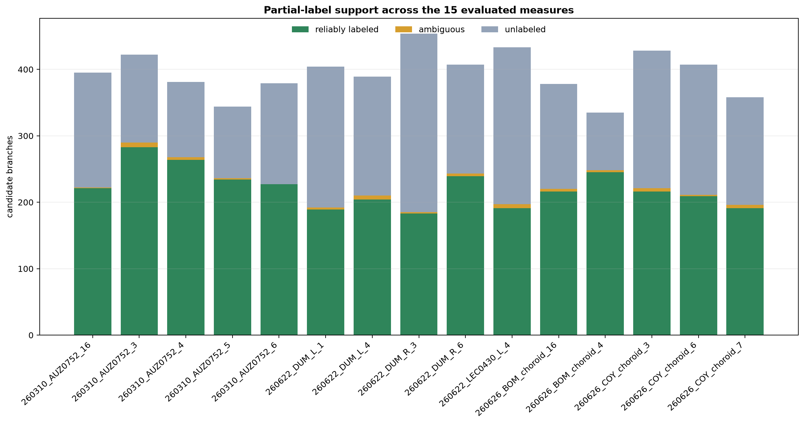

The candidate maps contain 5,914 branches in total: 3,312 reliably labeled
(56.0%), 54 ambiguous (0.9%), and 2,548 unlabeled (43.1%). This is enough
evidence for held-out branch evaluation, but it remains a partial-label study:
the reported class scores describe the reliably annotated subset, not the
entire choroidal tree.

### 9.3 Primary partition endpoint on the exhaustive subset

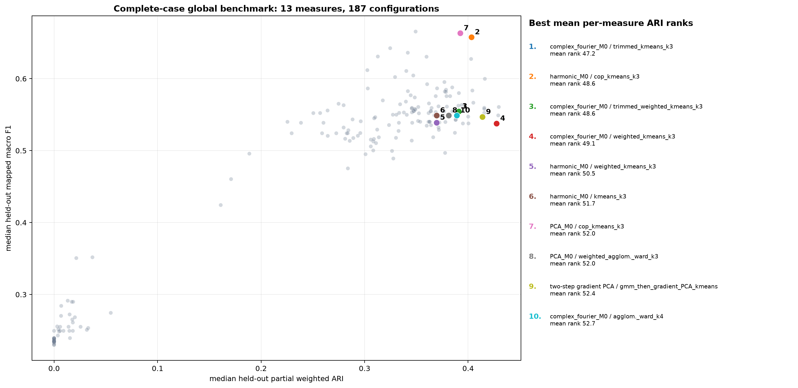

The horizontal axis is the primary endpoint: held-out partial weighted ARI for
the anonymous partition. The vertical axis adds the offline semantic naming
score. Each point is one configuration, summarized by its median over measures;
the highlighted configurations are ordered by their mean within-measure ARI
rank. Rank and median value answer slightly different questions, and their
leaders are not identical.

| Selection criterion | Configuration | Weighted ARI, median [IQR] | Offline macro F1, median [IQR] |
|---|---|---:|---:|
| Best mean per-measure ARI rank | Complex Fourier + trimmed K-means, (k=3) | 0.391 [0.327–0.460] | 0.555 [0.506–0.642] |
| Highest median weighted ARI | PCA + trimmed K-means, (k=3) | **0.430** [0.321–0.435] | 0.561 [0.502–0.586] |
| Highest median offline macro F1 | Gradient-PCA + COP-KMeans, (k=3) | 0.349 [0.307–0.432] | **0.665** [0.528–0.681] |
| Highest median physiology-mapped macro F1 | Three-band correlation + COP-KMeans, (k=3) | 0.313 [0.301–0.411] | 0.631 [0.618–0.684] |

The last method has median physiology-mapped macro F1 0.623 [0.534–0.684].
COP-KMeans nevertheless uses labeled constraints during clustering: its
physiology mapping may be label-free, but the complete fitted pipeline is not.
It must be reported separately from fully unsupervised methods.

For the only configuration present in all 15 measures—three-band correlation +
Ward (k=3)—the weighted ARI median is 0.297 (range −0.013–0.723), offline
macro F1 is 0.518 (0.437–0.761), and physiology-mapped macro F1 is 0.445
(0.246–0.761). A single common baseline is insufficient for a 15-measure method
ranking, but its wide range already demonstrates strong acquisition dependence.

### 9.4 Comparison with the current threshold pipeline

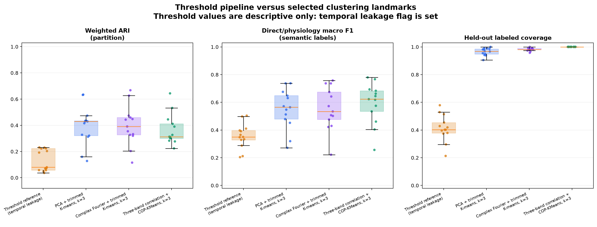

The current threshold pipeline is an important engineering reference. It
applies fixed correlation thresholds—HF below −0.47 for the aliased-artery
seed, M0 below −0.30 for anti-correlated candidates, and M0 above 0.24 for
arteries—followed by connectivity and morphology. A candidate branch receives
a semantic label only when at least 40% of its pixels belong to one threshold
mask.

| Method | Weighted ARI, median [IQR] | Direct/physiology macro F1, median [IQR] | Labeled coverage, median [IQR] |
|---|---:|---:|---:|
| Current threshold reference | 0.080 [0.058–0.223] | 0.350 [0.329–0.397] | 0.402 [0.379–0.454] |
| PCA + trimmed K-means, (k=3) | **0.430** [0.321–0.435] | 0.564 [0.479–0.648] | 0.968 [0.949–0.986] |
| Complex Fourier + trimmed K-means, (k=3) | 0.391 [0.327–0.460] | 0.534 [0.476–0.674] | 0.981 [0.980–0.989] |
| Three-band correlation + COP-KMeans, (k=3) | 0.313 [0.301–0.411] | **0.623** [0.534–0.684] | **1.000** [1.000–1.000] |

#### Spatial comparison on three measures

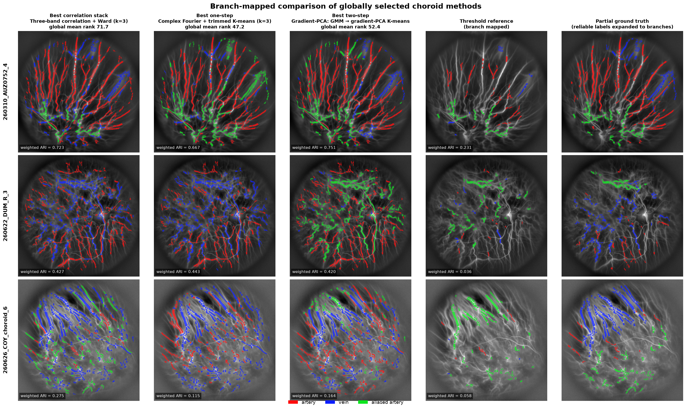

The three method columns are selected once from the 13-measure aggregate—not
separately for each displayed image—using the best mean within-measure rank on
held-out partial weighted ARI. “Best one-step” excludes the separately reported
correlation-stack family. The fixed selections are:

- three-band correlation + Ward, (k=3);
- complex Fourier + trimmed K-means, (k=3);
- two-step gradient-PCA with GMM first and gradient-PCA K-means second.

Every colored prediction is expanded to complete candidate branches. The
threshold masks are converted with the same 40%-overlap branch rule, while the
partial-ground-truth column expands only reliably labeled branches. For the
anonymous one-step methods, colors use the archive's offline semantic mapping
learned from the constraint subset; the displayed weighted ARI itself is
permutation-invariant and does not depend on those colors. Two-step and
threshold colors are their method-native semantic assignments.

The comparison uses the 13 measures containing both the threshold result and
the exhaustive clustering grid. The largest practical threshold limitation is
coverage: it assigns only about 40% of reliably labeled branches, whereas the
selected clustering landmarks assign approximately 97–100%. Assigned-only
threshold metrics could therefore look deceptively favorable and must always
be shown beside coverage.

These threshold values remain **descriptive rather than ranking-eligible**.
The candidate builder conservatively marks every externally supplied
`precomputed_thresholds` labeling with `temporal_leakage=True`. In the global
runner these labels are generated from `fit_videos`, but the default
`clean-all-valid` protocol does not reserve disjoint signal-evaluation cycles.
The flag therefore records a protocol limitation, not proof of one accidental
code path. A fair confirmatory comparison requires the alternating temporal
split, verification that both threshold and clustering inputs use only fit
frames, and signal evaluation on disjoint frames; the flag can then be made
conditional on that verified protocol.

### 9.5 Between-measure heterogeneity

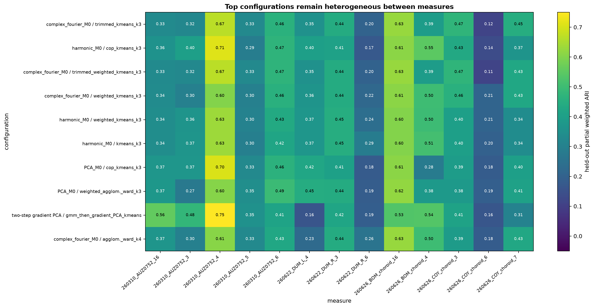

No configuration wins the primary endpoint on more than one of the 13
exhaustively evaluated measures. Even the best-ranked configurations span low
and high ARI values depending on the acquisition. The choice of representation
and clusterer therefore does not yet generalize uniformly; reporting only the
pooled branch score or only the best sample would conceal this instability.

The repeated identifiers also show that the 15 acquisitions are not 15
independent people. Measures should remain the unit of descriptive plots, but
uncertainty estimates and final model selection should be grouped by subject
identifier. Moreover, the exhaustive subset contains only four of the five
subject identifiers because the LEC measure has only the baseline.

### 9.6 Offline versus physiology-based semantic naming

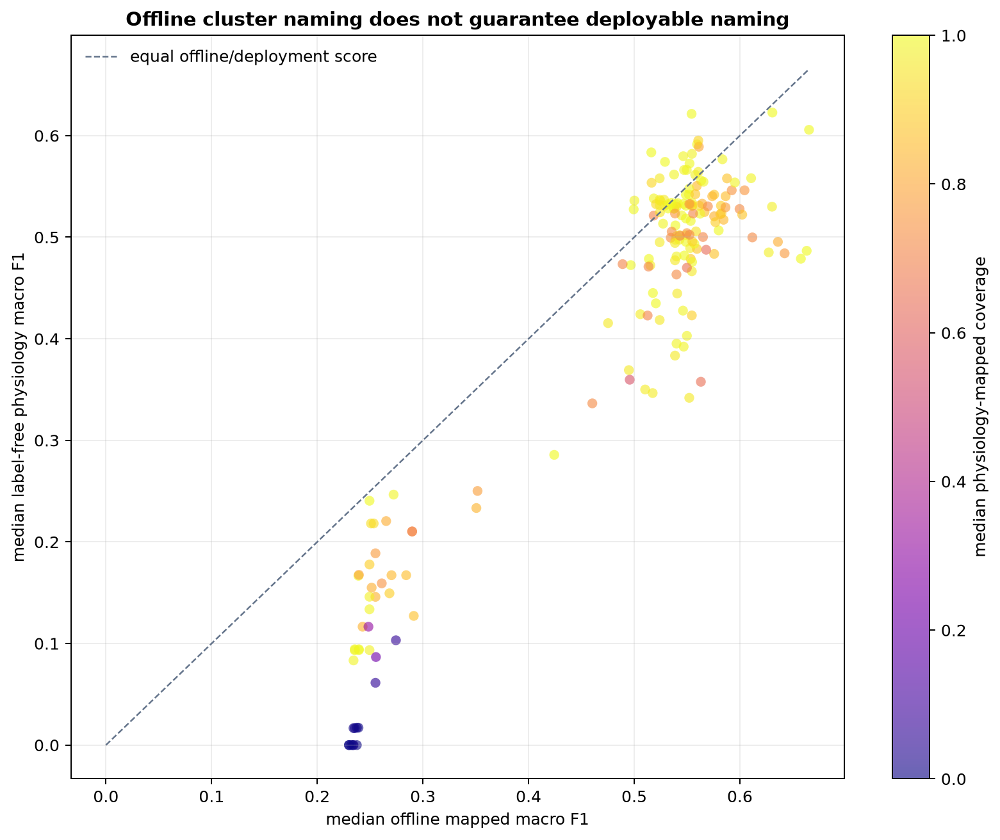

Most configurations lie below the equality line: naming clusters from partial
ground-truth evidence is generally easier than naming them from physiological
correlation prototypes. Coverage must accompany physiology macro F1 because a
prototype mapper can improve apparent precision by leaving difficult clusters
unmapped. This plot evaluates the naming stage; it does not make a constrained
clusterer itself label-free.

### 9.7 What the global benchmark supports

1. Cardiac representations contain useful class structure, but the achievable
   partition quality is moderate and heterogeneous.
2. No single representation/clusterer dominates every acquisition or every
   endpoint.
3. Simple PCA, complex Fourier, harmonic, and interpretable three-band
   correlation representations all appear in the leading sets; added method
   complexity is not automatically beneficial.
4. Trimmed K-means is promising for the primary partition endpoint, consistent
   with the original concern about outliers.
5. Constrained K-means is strong for semantic endpoints, but this advantage
   partly answers a different, semi-supervised question.
6. Offline and physiology-based mapping must remain separate evaluation axes.
7. The current fixed-threshold pipeline has substantially lower coverage and
   lower median held-out scores than the selected clustering landmarks, while
   still requiring a leakage-free rerun for a formally fair comparison.

### 9.8 What remains unresolved

- Two measures must still be run over the complete configuration grid before
  calling this a 15-measure comparative benchmark.
- The three failing two-step threshold configurations require either a code fix
  and rerun or a predeclared policy that treats their failure as part of method
  reliability.
- With few subject identifiers and repeated measures, differences of a few
  hundredths are not evidence of superiority. Subject-grouped intervals or
  paired tests are required after forming a small, predeclared shortlist.
- Partial masks can be non-random: large and visually obvious branches may be
  overrepresented. None of these scores validates the unlabeled vascular tree.
- Candidate-vessel extraction is shared by all methods and is not tested by this
  branch-classification benchmark.

---

## 10. Recommended next experiment

1. Freeze candidate extraction, branch-size filtering, artifact rules, class
   order, random seeds, and benchmark candidates.
2. Keep the previously inspected acquisitions marked as development samples.
3. Complete the missing 190 configurations for `260622_DUM_L_1` and
   `260622_LEC0430_L_4`, then fix or explicitly retain the three recorded method
   failures. Rebuild the aggregate CSV from the per-measure files.
4. Use the measure—or subject when repeated measures exist—as the statistical
   unit. Report medians, IQRs, patient-level bootstrap intervals, average ranks,
   failures, and coverage.
5. Predeclare the endpoint hierarchy:
   held-out partial weighted ARI → held-out mapped macro F1 → deployable
   physiology macro F1 plus coverage.
6. Shortlist a small Pareto set rather than choosing from all 191 configurations
   with exhaustive pairwise significance tests. The present results nominate
   PCA/trimmed K-means, complex-Fourier/trimmed K-means, and three-band
   correlation as useful starting families; include constrained methods in a
   separate semi-supervised track.
7. Inspect saved overlays and class signals for each shortlisted method.
8. Re-evaluate saved cluster archives after improving partial masks. Rerun
   clustering only if the candidate branch map changes.
9. Benchmark candidate-vessel extraction as a separate experiment.
10. Use the selected pre-mask strategy to design the deep model and PU losses;
    retain pre-mask uncertainty rather than converting every branch to a hard
    target.

---

## 11. Suggested slide sequence

1. Clinical/imaging motivation and five target masks.
2. Why static choroid appearance and sparse labels are insufficient.
3. Overall physiology-guided pipeline diagram.
4. Candidate vessel mask and partial-positive annotations.
5. Branch signals and cardiac-cycle quality control.
6. Embedding intuition: correlation, Fourier/harmonic, PCA/gradient PCA,
   autocorrelation.
7. Whole-shape methods with the real-sample K-Shape centroids.
8. Clustering families and the problems they address: outliers, branch size,
   unknown cluster count, and constraints.
9. One-step versus two-step organization with stage-wise figures.
10. Anonymous cluster IDs versus offline and deployment semantic mapping.
11. PU-aware evaluation hierarchy.
12. Three-sample benchmark scatter and heterogeneity heatmap.
13. What is established, what remains uncertain, and the 15-measure plan.

---

## 12. Reproducibility and figure provenance

- Main notebook: [choroid_segmentation.ipynb](choroid_segmentation.ipynb)
- Benchmark implementation: [choroid_benchmark.py](choroid_benchmark.py)
- Global runner: [run_choroid_global_benchmark.py](run_choroid_global_benchmark.py)
- Complete metric reference: [CHOROID_BENCHMARK_METRICS.md](CHOROID_BENCHMARK_METRICS.md)
- Presentation figure builder:
  [build_choroid_presentation_figures.py](build_choroid_presentation_figures.py)
- Generated figures and benchmark summary CSV:
  [choroid_presentation_assets](choroid_presentation_assets/)

To regenerate the schematic, K-Shape demonstration, and benchmark summary:

```powershell
python sandbox/build_choroid_presentation_figures.py
```

All other figures were copied from method-specific artifacts under
`D:/benchmarks/260310_AUZ0752_16_choroid_clean_min25_visualizations` or the two
explicitly named comparison measures. Their titles retain the exact
representation/method keys used by the benchmark.
